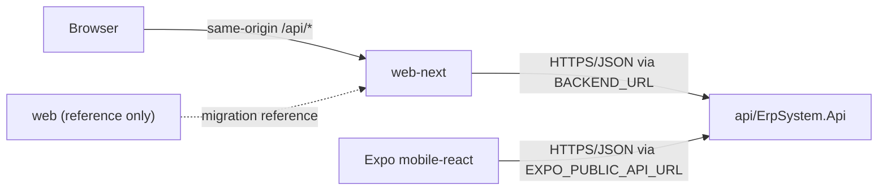

# ERP System

This repository contains the ASP.NET Core API, the supported Next.js browser
client, and the Expo/React Native mobile client for an ERP System. Human
Resources (HR) and Accounting are currently supported business areas, with the
solution structured so future activities can be added as independent modules.

## Start here

For any new module or feature, begin with the general
[ERP documentation guide](documentation/project/ERP_DOCUMENTATION_GUIDE_AR.md),
and the [shared reuse catalog](documentation/project/SHARED_REUSE_CATALOG.md),
then inspect the owning module package under `documentation/modules/`. HR books
remain valid references for their own capabilities; they are not global ERP
requirements.

## Application Ownership

| Application | Status | Purpose |
| --- | --- | --- |
| `api/ErpSystem.Api/` | Active | ERP backend API host |
| `web-next/` | Canonical | Supported frontend and deployment target |
| `mobile-react/` | Active | Supported Expo/React Native mobile client |
| `web/` | Legacy | Temporary migration/reference copy; scheduled for removal |

New browser features target `web-next/`; new mobile features target
`mobile-react/`. Shared business and HTTP contracts remain owned by the API.

Do not add product changes to `web/`. It may be changed only when work is required to migrate remaining behavior to `web-next/` or remove the legacy application. Before deleting it, verify that any still-required behavior and assets have been migrated.

## API And Frontend Relationship

`web-next` and `mobile-react` are supported clients of
`api/ErpSystem.Api`. Browser API requests use the same-origin `/api/*`
path and pass through the Next.js proxy at
[`web-next/src/app/api/[...path]/route.ts`](web-next/src/app/api/%5B...path%5D/route.ts).
The proxy resolves the backend origin from `BACKEND_URL`. Mobile requests use
the centralized Axios/API service and resolve the backend from
`EXPO_PUBLIC_API_URL`.

The relationships are recorded in
[`architecture/application-relation.ts`](architecture/application-relation.ts),
including canonical project paths and transport owners. Graphify indexes the
API, browser and mobile clients; `web` is excluded because it is reference-only.

## Main Projects

- Backend: `api/ErpSystem.Api/` (solution: `api/ErpSystem.sln`)
- Backend modules: `api/Modules/HR/` and `api/Modules/Accounting/`; each uses
  the canonical Contracts, Domain, Application, Infrastructure, Presentation,
  and Bootstrap projects.
- Browser frontend: `web-next/`
- Mobile frontend: `mobile-react/`
- Centralized project documentation: `documentation/`

The canonical three-project Countries implementation review is
[`documentation/project/COUNTRIES_FEATURE_FULL_REVIEW.md`](documentation/project/COUNTRIES_FEATURE_FULL_REVIEW.md).
The reusable review workflow and source manifest are indexed from
[`documentation/system/README.md`](documentation/system/README.md).
