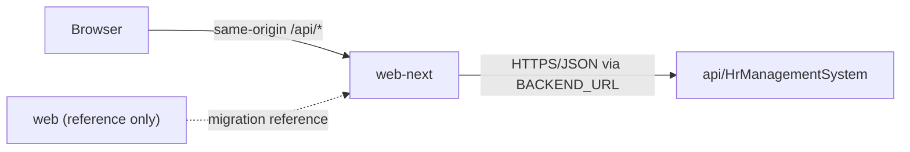

# HR Management System

This repository contains the ASP.NET Core API and the supported Next.js frontend for the HR Management System.

## Application Ownership

| Application | Status | Purpose |
| --- | --- | --- |
| `api/HrManagementSystem/` | Active | Backend API |
| `web-next/` | Canonical | Supported frontend and deployment target |
| `web/` | Legacy | Temporary migration/reference copy; scheduled for removal |

All new frontend features, fixes, tests, configuration, and documentation must target `web-next/`.

Do not add product changes to `web/`. It may be changed only when work is required to migrate remaining behavior to `web-next/` or remove the legacy application. Before deleting it, verify that any still-required behavior and assets have been migrated.

## API And Frontend Relationship

`web-next` is the only supported client of `api/HrManagementSystem`. Browser API requests use the same-origin `/api/*` path and pass through the Next.js proxy at [`web-next/src/app/api/[...path]/route.ts`](web-next/src/app/api/%5B...path%5D/route.ts). The proxy resolves the backend origin from `BACKEND_URL` and forwards requests to the ASP.NET Core API.

The relationship is recorded in [`architecture/application-relation.ts`](architecture/application-relation.ts), including the canonical project paths and the files that own endpoint routing. Graphify indexes `api/HrManagementSystem` and `web-next` together; `web` is excluded because it is reference-only.

## Main Projects

- Backend: `api/HrManagementSystem/`
- Frontend: `web-next/`
- Shared project documentation: `Docs/`
